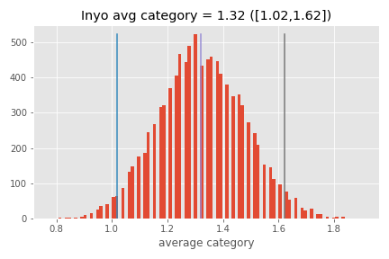

# California Drought Analysis 2020

1. Introduction 

California's weather situation seems to get worse as climate change is increasing. Evidence of this can be seen by an increase of wildfires in the Western United States. Wildfires tend to form around dry areas, so we decided to analyze the drought statuses of California couties us the [US Drought Monitor](https://droughtmonitor.unl.edu/). US Drought Monitor categorizes the droughts in the following five categories: D0 for abnormally dry, D1 for moderate drought, D2 for severe drought, D3 for extreme drought, and D4 for exceptional drought. This project creates first creates a choropleth map of California based on the average drought value based on the following values: -1 for no drought, 0 for D0, 1 for D1, and so on. We then picked Inyo County, a county with a D4 rating in the last quarter of the month, and Trinity County, a county with a high average drought rating for comparison. The project compares the two counties via a time fill between graph of their drought statuses, a bar chart measuring the weeks of drought these two counties experienced, calculates the average drought status with a bootstrapped 95% confidence interval, and a t-test hypothesis test.

2. Procedures

2a) Non-consecutive weeks data frame

We proceded to procure the non-consecutive weeks data throught the [Weeks In Drought](https://droughtmonitor.unl.edu/DmData/DataDownload/WeeksInDrought.aspx) page, downloading five csv files for California from 1 January 2020 to 31 December 2020 for the all five thresholds with a minimum of two weeks. Since these are thresholds, the csv reports whether that county experienced that drought category or higher. In other words, the D0 csv reports the weeks each county experience a D0-D4 drought, the D1 csv reports the weeks each county experience a D1-D4 drought, et cetera. Thus, when making the data frame, we need to report the D4 weeks, subtract the D4 values from the D3 weeks and report that number, subtract the report D4 and D3 numbers from the D2 value and report that value, and continue the process till we get the actuall number of weeks each county experienced in each category. 

The monitor does not include weeks without drought. 2020 had 53 calendar weeks, so we subtracted the D0-D4 weeks from 53 to retrieve the weeks without drought value.

2b) Consecutive weeks data frame

For graphing drought over time, we also retrieved the consecutive weeks csv files for California 1 January 2020 to 31 December 2020 for all 5 drought categories from the Weeks in drought page. We concatenated the csv files in one data frame and ordered by county and start date for each row.

2c) Choropleth

2d) Time Series Graph

2e) Bar chart

2f) 95% Confidence Interval

2g) T-test

3. Results

3a) Choropleth

This is choropleth of the weekly average drought categories for each county. -1 indicates no drought, 0 indicates as D0 (abnormally dry), 1 indicates as D1 (moderate drought), 2 indicates (severe drought), 3 indicates (extreme drought), and 4 indicates exceptional drought

3b) Time Series Graph 

3c) Bar chart

3d) 95% Confidence Interval

3e) T-test

4. Conclusions and future works

Rejecting the null hypothesis, Trinity has a larger average drought category than Inyo. Based on choropleth, time series graph, non-consecutive weeks bar chart, and bootstrapped mean, Trinity has experienced longer and worse drought than Inyo. On further investigation on 2020 California fires, it is reported the Trinity County was one of the counties affected by The August Complex fire in 11 September 2020. With increase of droughts in the West, it is feared that the Western states will experience more wildfires caused by climate change.
