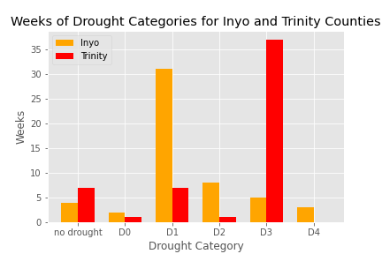
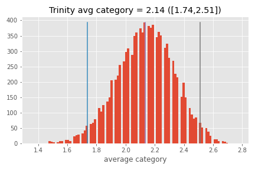

# California Drought Analysis 2020

1. Introduction 

California's weather situation seems to get worse as climate change is increasing. Evidence of this can be seen by an increase of wildfires in the Western United States. Wildfires tend to form around dry areas, so we decided to analyze the drought statuses of California couties us the [US Drought Monitor](https://droughtmonitor.unl.edu/). US Drought Monitor categorizes the droughts in the following five categories: D0 for abnormally dry, D1 for moderate drought, D2 for severe drought, D3 for extreme drought, and D4 for exceptional drought. This project creates first creates a choropleth map of California based on the average drought value based on the following values: -1 for no drought, 0 for D0, 1 for D1, and so on. We then picked Inyo County, a county with a D4 rating in the last quarter of the month, and Trinity County, a county with a high average drought rating for comparison. The project compares the two counties via a time fill between graph of their drought statuses, a bar chart measuring the weeks of drought these two counties experienced, calculates the average drought status with a bootstrapped 95% confidence interval, and a t-test hypothesis test.

2. Procedures

2a) Non-consecutive weeks data frame

We proceded to procure the non-consecutive weeks data throught the [Weeks In Drought](https://droughtmonitor.unl.edu/DmData/DataDownload/WeeksInDrought.aspx) page, downloading five csv files for California from 1 January 2020 to 31 December 2020 for the all five thresholds with a minimum of two weeks. Since these are thresholds, the csv reports whether that county experienced that drought category or higher. In other words, the D0 csv reports the weeks each county experience a D0-D4 drought, the D1 csv reports the weeks each county experience a D1-D4 drought, et cetera. Thus, when making the data frame, we need to report the D4 weeks, subtract the D4 values from the D3 weeks and report that number, subtract the report D4 and D3 numbers from the D2 value and report that value, and continue the process till we get the actuall number of weeks each county experienced in each category. 

The monitor does not include weeks without drought. 2020 had 53 calendar weeks, so we subtracted the D0-D4 weeks from 53 to retrieve the weeks without drought value.

2b) Consecutive weeks data frame

For graphing drought over time, we also retrieved the consecutive weeks csv files for California 1 January 2020 to 31 December 2020 for all 5 drought categories from the Weeks in drought page. We concatenated the csv files in one data frame and ordered by county and start date for each row.

2c) Choropleth
Using the FIPS and average county values in our non-consective weeks data frame, we created a seaborn choropleth. To get shapes of the counties we procured the [geojson-counties-fips.json](https://raw.githubusercontent.com/plotly/datasets/master/geojson-counties-fips.json). Due to droughtless weeks being a -1, we ranged the sunset color bar fron -1 to 4.

2d) Time Series Graph

We used the consecutive weeks data frame to create fill between plots to illistrate the drought weeks over time. Like the non-consecutive weeks data, the consecutive weeks data report weeks that met or exceeded the threshold category. To mitigate this issue, we mapped the D0 weeks with a fill between of -1 to 0. Then we overplotted the D1 weeks from -1 to 1. Following that, we overplotted the D2 weeks from -1 to 2. This trend continued until all categories are plotted. 

2e) Bar chart

Consulting the non-consecutive weeks data frame, we plotted the Inyo and Trinity weeks as a bar chart separating the data by category.

2f) 95% Confidence Interval

Since we only gathered 53 weeks for each county, we proceed to bootstrap those weeks to produce 10,000 bootstrap samples. We took the means of the of those samples and plotted them in a histogram. To get the 95% confidence interval, we reported the 2.5 and 97.5 percentiles of the sample means. Our reported mean, is the mean of those means.

2g) T-test

Using the Inyo and Trinity data from the non-consecutive weeks data frame, we performed a t-test, since we do not have a population standard deviation for the data we collected. To illistrate the t-test, we chose a standard alpha of 0.05 and plotted gaussian curves using mean and standard errors of the samples.

3. Results

3a) Choropleth

This is choropleth of the weekly average drought categories for each county. -1 indicates no drought, 0 indicates as D0 (abnormally dry), 1 indicates as D1 (moderate drought), 2 indicates (severe drought), 3 indicates (extreme drought), and 4 indicates exceptional drought. It appears that the Northern half of California is experiencing worse droughts than the Southen half. It makes sense that the Southwestern portion of the state would experience less drought, since it is by the coast. However, it is troubling to see that the wooded North would be experiencing worse drought than the Southeastern deserts. This may explain why there are more fires in the North than the South.

3b) Time Series Graph

Above are the drought statuses of Inyo and Trinity counties. Yellow indicates as D0 (abnormally dry), orange indicates as D1 (moderate drought), red indicates (severe drought), brown indicates (extreme drought), and black indicates exceptional drought. This time empty space signifies no drought. Even though Inyo county is one of the two counties that experienced a D4 drought late in 2020, Trinity has experienced a long period of D3 drought in 2020.

3c) Bar chart

Here are the counts of the non-secutitve weeks of Inyo and Trinity counties. As explained above, Trinity has experienced a long D3 drought, longer than Inyo experiencing a D2 drought.

3d) 95% Confidence Interval

According to the bootstrapped means, Inyo's weekly average category is 1.32 with a confidence interval of 1.02 to 1.62. Trinity's weekly average category is 2.13 with a confidence interval of 1.72 to 2.51. Seeing that the confidence intervals don't even overlap, one can assume that Trinity is significantly experiencing worse drought, but to make that conclusion solid, we performed a t-test

3e) T-test

Our t-test between the two counties resulted in a p-value of 0.002 with a power of 0.998, which is below our threshold of $\alpha = 0.05$. Thus, we reject our null hypothesis that these two counties are experiencing similar drought conditions.

4. Conclusions and future works

Rejecting the null hypothesis, Trinity has a larger average drought category than Inyo. Based on choropleth, time series graph, non-consecutive weeks bar chart, and bootstrapped mean, Trinity has experienced longer and worse drought than Inyo. On further investigation on 2020 California fires, it is reported the Trinity County was one of the counties affected by The August Complex fire in 11 September 2020. With increase of droughts in the West, it is feared that the Western states will experience more wildfires caused by climate change. For future works, it would be interesting to see a correlation with 2020 fires with 2020 droughts.
